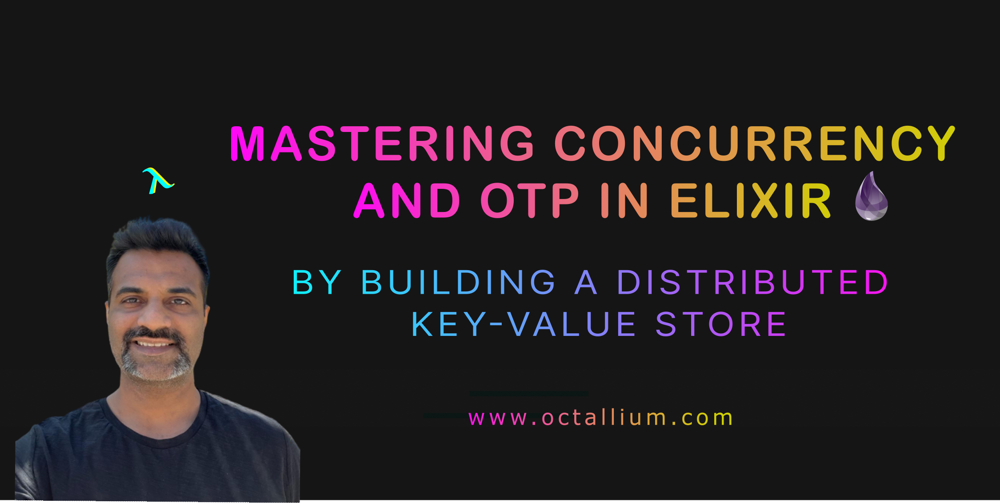

# Mastering Concurrency & OTP in Elixir

__By Building a Distributed Key-Value Store.__

Welcome to this course, this course is all about mastering the concurrency framework offered by `Elixir` and the underlying `Erlang Virtual Machine (Beam)`.

## Introduction

We are going to start small, right from the basics and build all the way to creating, testing and releasing our application across various nodes on our network.

Throughout this course we are going to take the `Key-Value` store from the official `Elixir` documentation and take a deep dive into each concept one at a time. 

I think this would be really helpful, as now you can have all the documentation as reference and also watch me code and explain everything on screen at the same time.

## Topics Covered

1. Process
2. Concurrency Model
3. Agents
4. Genservers
5. Supervisors
6. Dynamic Supervisors
7. ETS
8. Application
9. Umbrella Project
10. Tasks
11. Testing
12. Release

## Audience

This course is meant for someone who understands basic Elixir or has taken my earlier free course [Functional Programming in Elixir](https://www.youtube.com/watch?v=BXrm_3nP7dw).

If you are a completely new to Elixir, then I would not recommend taking this course directly, at the same time you do not need to be expert in Elixir to take this course, however some understanding of Elixir is required to follow on with this course.

## Links

1. Course - [Mastering Concurrency & OTP in Elixir](https://octallium.thinkific.com/)
2. Github - [KV Umbrella](https://github.com/octallium/kv_umbrella)
2. Github - [KV Store](https://github.com/octallium/kv_store)
3. Website - [www.octallium.com](https://www.octallium.com/)
4. YouTube - https://www.youtube.com/@octallium
5. [@octallium](https://twitter.com/octallium)
